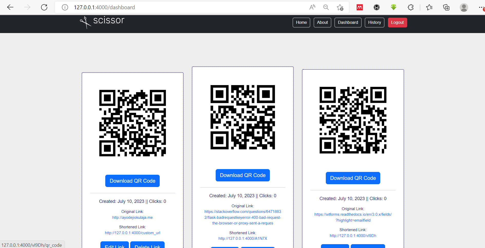
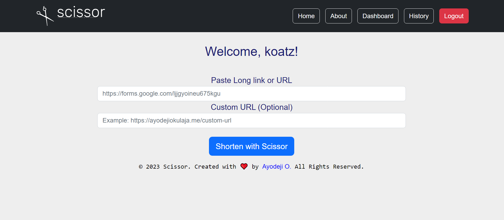

<!-- Back to Top Navigation Anchor -->
<a name="readme-top"></a>

<!-- Project Shields -->
<div align="center">

  [![Contributors][contributors-shield]][contributors-url]
  [![Forks][forks-shield]][forks-url]
  [![Stargazers][stars-shield]][stars-url]
  [![Issues][issues-shield]][issues-url]
  [![MIT License][license-shield]][license-url]
  [![Twitter][twitter-shield]][twitter-url]
</div>

<!-- Project Logo -->
<br />
<div align="center">
  <a href="https://github.com/ErikMidas/Scissor">
    
  </a>
</div>

<br />

<div>
  <p align="center">
    <a href="https://github.com/ErikMidas/Scissor#readme"><strong>Explore the docs »</strong></a>
    <br />
    <br />
    <a href="scissor/static/images/scissor1.png">View Demo</a>
    ·
    <a href="https://github.com/ErikMidas/Scissor/issues">Report Bug</a>
    ·
    <a href="https://github.com/ErikMidas/Scissor/issues">Request Feature</a>
  </p>
</div>

---

<!-- Table of Contents -->
<details>
  <summary>Table of Contents</summary>
  <ol>
    <li>
      <a href="#about-Scissor">About Scissor</a>
      <ul>
        <li><a href="#built-with">Built With</a></li>
      </ul>
    </li>
    <li>
      <a href="#lessons-learned">Lessons Learned</a>
    </li>
    <li>
      <a href="#usage">Usage</a>
      <ul>
        <li><a href="#prerequisites">Prerequisites</a></li>
        <li><a href="#installation">Installation</a></li>
      </ul>
    </li>    
    <li><a href="#sample">Sample</a></li>
    <li><a href="#license">License</a></li>
    <li><a href="#contact">Contact</a></li>
    <li><a href="#acknowledgements">Acknowledgements</a></li>
  </ol>
  <p align="right"><a href="#readme-top">back to top</a></p>
</details>

---

<!-- About the Blog -->
## About Scissor

Scissor is your ultimate solution for creating concise and shareable URLs. In the era of social media, where brevity is key, Scissor helps you "cut through the clutter" by transforming lengthy URLs into compact, easy-to-manage links.

With Scissor, you can effortlessly convert long URLs into short and customizable links. Whether you're sharing on social media platforms, email, or any other digital channel, Scissor ensures your links are optimized for maximum impact. Say goodbye to unwieldy URLs and hello to streamlined sharing.

Additionally, Scissor goes beyond traditional link shortening by providing QR code generation. You can generate QR codes for your links, allowing users to scan and access your content quickly and conveniently.

Experience the power of simplicity with Scissor. Start shortening your URLs today and make every link count in the fast-paced world of social media.

It was built as my capstone project for Backend Engineering track using Python Flask framework at <a href="https://altschoolafrica.com/schools/engineering">AltSchool Africa</a>.


<p align="right"><a href="#readme-top">back to top</a></p>

### Built With:

![Python][python]
![Flask][flask]
![Jinja][jinja]
![HTML5][html5]
![CSS3][css3]
![SQLite][sqlite]

<p align="right"><a href="#readme-top">back to top</a></p>

---
<!-- Lessons from the Project -->
## Lessons Learned

Creating this blog helped me learn and practice:
* Web Design
* Debugging
* Routing
* Database Management
* Internet Security
* User Authentication
* User Authorization
* Flash Messaging
* Documentation
* Caching
* Rate Limiting
* URL Shortening
* Email Verification


<p align="right"><a href="#readme-top">back to top</a></p>

---

<!-- GETTING STARTED -->
## Usage

To get a local copy up and running, follow the steps below.

### Prerequisites

Python3: [Get Python](https://www.python.org/downloads/)

### Installation

1. Clone this repo
   ```sh
   git clone https://github.com/ErikMidas/Scissor.git
   ```
2. Create a virtual environment
   ```sh
   py -m venv env
   ```
3. Activate the virtual environment
   ```sh
   source env/Scripts/activate
   ```
4. Install project packages
   ```sh
   pip install -r requirements.txt
   ```
5. Create a file named .env file in the root directory and add the content below there
   ```sh
   SECRET_KEY = os.urandom(32)
   ```
6. Run the command below to run the Flask server
   ```sh
   py app.py
   ```
7. Open the link generated in the terminal on a browser or visit [http://localhost:4000](http://localhost:4000)

<p align="right"><a href="#readme-top">back to top</a></p>

---

<!-- Sample Screenshot -->
## Sample

<br />
<p>Sample 1</p>

[![Scissor Screenshot][Scissor-screenshot]](https://github.com/ErikMidas/Scissor/blob/main/scissor/static/images/scissor1.png)

<br />

Sample 2



<br />

Sample 3


<br/>

<p align="right"><a href="#readme-top">back to top</a></p>

---

<!-- License -->
## License

Distributed under the MIT License. See <a href="https://github.com/ErikMidas/Scissor/blob/main/LICENSE">LICENSE</a> for more information.

<p align="right"><a href="#readme-top">back to top</a></p>

---

<!-- Contact -->
## Contact

Ayodeji Okulaja - [@Koats14](https://twitter.com/koats14) - ayotoku@gmail.com

Project Link: [Scissor](https://github.com/ErikMidas/Scissor)

Live Link: [ayodejiokulaja.me](https://ayodejiokulaja.me)

<p align="right"><a href="#readme-top">back to top</a></p>

---

<!-- Acknowledgements -->
## Acknowledgements

This project was made possible by:

* [AltSchool Africa School of Engineering](https://altschoolafrica.com/schools/engineering)
* [Caleb Emelike's Flask Lessons](https://github.com/CalebEmelike)
* [Stack Overflow](https://stackoverflow.com/)

<p align="right"><a href="#readme-top">back to top</a></p>

---

<!-- Markdown Links & Images -->
[contributors-shield]: https://img.shields.io/github/contributors/ErikMidas/Scissor.svg?style=for-the-badge
[contributors-url]: https://github.com/ErikMidas/Scissor/graphs/contributors
[forks-shield]: https://img.shields.io/github/forks/ErikMidas/Scissor.svg?style=for-the-badge
[forks-url]: https://github.com/ErikMidas/Scissor/network/members
[stars-shield]: https://img.shields.io/github/stars/ErikMidas/Scissor.svg?style=for-the-badge
[stars-url]: https://github.com/ErikMidas/Scissor/stargazers
[issues-shield]: https://img.shields.io/github/issues/ErikMidas/Scissor.svg?style=for-the-badge
[issues-url]: https://github.com/ErikMidas/Scissor/issues
[license-shield]: https://img.shields.io/github/license/ErikMidas/Scissor.svg?style=for-the-badge
[license-url]: https://github.com/ErikMidas/Scissor/blob/main/LICENSE.txt
[twitter-shield]: https://img.shields.io/badge/-@koats14-1ca0f1?style=for-the-badge&logo=twitter&logoColor=white&link=https://twitter.com/koats14
[twitter-url]: https://twitter.com/koats14
[Scissor-screenshot]: scissor/static/images/scissor1.png
[python]: https://img.shields.io/badge/python-3670A0?style=for-the-badge&logo=python&logoColor=ffdd54
[flask]: https://img.shields.io/badge/flask-%23000.svg?style=for-the-badge&logo=flask&logoColor=white
[jinja]: https://img.shields.io/badge/jinja-white.svg?style=for-the-badge&logo=jinja&logoColor=black
[html5]: https://img.shields.io/badge/html5-%23E34F26.svg?style=for-the-badge&logo=html5&logoColor=white
[css3]: https://img.shields.io/badge/css3-%231572B6.svg?style=for-the-badge&logo=css3&logoColor=white
[sqlite]: https://img.shields.io/badge/sqlite-%2307405e.svg?style=for-the-badge&logo=sqlite&logoColor=white
